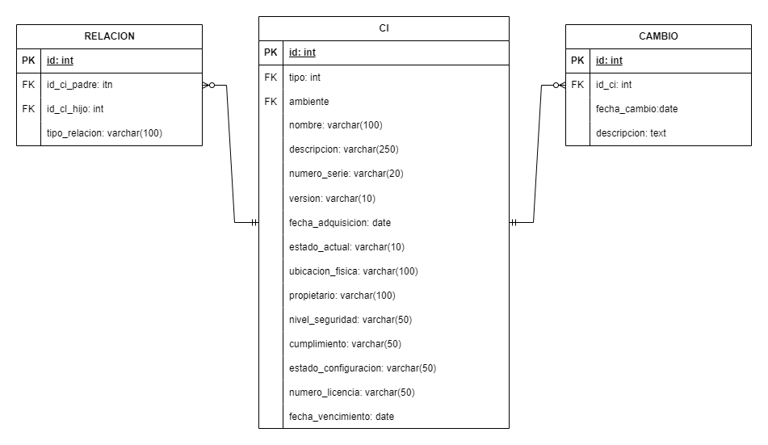

# CMDB API REST

API RESTful para la gestión de una CMDB (Base de Datos de Elementos de Configuración), incluyendo relaciones entre CIs y registro de auditoría de cambios.

## Tecnologías
- Node.js + Express
- Sequelize ORM
- MySQL
- JWT para autenticación
- Docker

## Instalación

### Requisitos
- Node.js
- MySQL
- Docker (opcional)

### Instalación manual

```bash
git clone https://github.com/tuusuario/cmdb-api.git
cd cmdb-api
npm install
npm run seed    # Carga datos de ejemplo
npm run dev     # Inicia en modo desarrollo
```

### Con Docker
```bash
docker build -t cmdb-api .
docker run -p 3000:3000 cmdb-api
```

## Autenticación

### Login

```http
POST /login
```

#### Body:
```json
{
  "username": "admin",
  "password": "admin123"
}
```

#### Respuesta:
```json
{
  "token": "..."
}
```

Usa el token en `Authorization: Bearer TOKEN` para acceder a rutas protegidas.

## Endpoints

### CI - Configuration Items

| Método | Ruta         | Descripción                    |
|--------|--------------|--------------------------------|
| GET    | /cis         | Listar todos los CIs           |
| GET    | /cis/:id     | Obtener CI por ID              |
| POST   | /cis         | Crear nuevo CI                 |
| PUT    | /cis/:id     | Actualizar un CI               |
| DELETE | /cis/:id     | Eliminar un CI                 |

### Relaciones entre CIs

| Método | Ruta           | Descripción                    |
|--------|----------------|--------------------------------|
| GET    | /relaciones    | Listar todas las relaciones    |
| POST   | /relaciones    | Crear relación entre CIs       |

### Auditoría de Cambios

| Método | Ruta         | Descripción                        |
|--------|--------------|------------------------------------|
| GET    | /cambios     | Listar cambios registrados         |
| POST   | /cambios     | Registrar cambio en un CI          |

## Pruebas

```bash
npm test
```

Se utiliza Jest + Supertest. Ejemplo de prueba incluida: creación de CI.

## Base de datos

### Tablas
- `CI`: Elementos de configuración
- `Relacion`: Relaciones entre CIs
- `Cambio`: Historial de cambios


